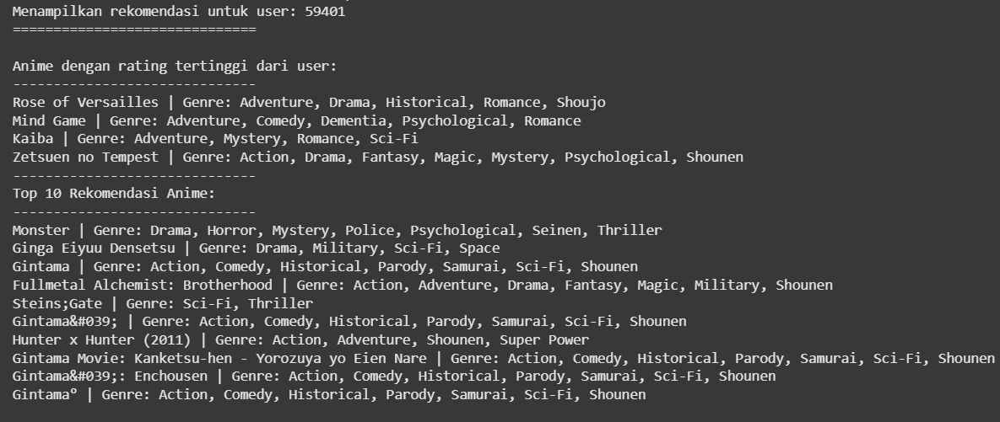
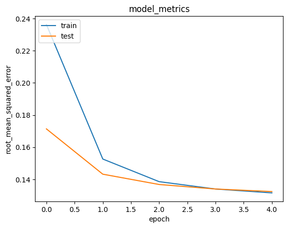

<<<<<<< HEAD
# Laporan Proyek Machine Learning - Dila Aura Futri

## Project Overview

Ribuan judul anime yang tersedia kadang membuat penonton bingung untuk menentukan tontonan yang cocok. Sistem rekomendasi yang menggunakan collaborative filteirng ini menjadi solusi karena dapat membantu pengguna menemukan gaya atau genre yang cocok dengannya.

**Mengapa Sistem Rekomendasi Anime Penting?**</br>

1. **Personalisasi Pengalaman Menonton** : Dengan memanfaatkan histori rating dan interaksi pengguna, sistem rekomendasi dapat menyajikan pilihan anime yang paling relevan, meningkatkan keterlibatan dan kepuasan pengguna.</br>
2. **Meningkatkan Engagement Platform** : Rekomendasi yang akurat dapat meningkatkan waktu yang dihabiskan pengguna dalam platform dan mendorong mereka untuk mengeksplorasi lebih banyak konten.</br>

**Relevansi dengan Tren Teknologi Terkini**</br>
Di tengah pesatnya perkembangan teknologi machine learning, pendekatan collaborative filtering menjadi solusi populer dalam membangun sistem rekomendasi berbasis data pengguna. Dengan algoritma seperti cosine similarity, sistem ini dapat memahami preferensi pengguna secara mendalam.</br>

**Tujuan Proyek**</br>
Proyek ini bertujuan untuk membangun sistem rekomendasi anime berdasarkan data rating pengguna menggunakan pendekatan collaborative filtering (User-Based dan Item-Based), dengan harapan meningkatkan relevansi rekomendasi dan pengalaman pengguna.

**REFERENSI**  
[Machine Learning Based Movie Recommendation System](https://ieeexplore.ieee.org/document/9667602)</br>
[Collaborative Filtering with Temporal Features for Movie Recommendation System](https://www.sciencedirect.com/science/article/pii/S1877050923001151)

## Business Understanding

### Problem Statements

- Banyak pengguna kebingungan dalam memilih anime karena banyaknya pilihan judul yang tersedia.
- Sistem rekomendasi bawaan beberapa platform belum mampu memberikan saran yang benar-benar sesuai dengan preferensi pengguna.
- Tidak adanya sistem personalisasi menyebabkan penurunan engagement pengguna terhadap platform.

### Goals

- Mengembangkan sistem rekomendasi anime yang dapat memberikan saran personal berdasarkan preferensi pengguna.
- Memanfaatkan metode collaborative filtering untuk memberikan rekomendasi berdasarkan kesamaan pengguna maupun kemiripan antar anime.
- Meningkatkan kepuasan pengguna terhadap platform tontonan anime dengan memberikan rekomendasi yang relevan dan menarik.

### Solution Approach

Untuk mencapai tujuan tersebut, berikut adalah dua pendekatan yang dapat digunakan dalam sistem rekomendasi berbasis collaborative filtering:

#### Solution statements

- **Model Collaborative Filtering Berbasis User-Item**</br>
  a. Membangun matriks interaksi pengguna terhadap anime.</br>
  b. Menggunakan cosine similarity untuk mengukur kesamaan antar pengguna.</br>
  c. Memberikan rekomendasi berdasarkan anime yang disukai oleh pengguna serupa.</br>
- **Model Collaborative Filtering Berbasis Item**</br>
  a. Menganalisis pola rating terhadap anime tertentu.</br>
  b. Mencari anime lain yang memiliki pola rating serupa.</br>
  c. Menyajikan rekomendasi berdasarkan kemiripan antar item (anime).

## Data Understanding

Dataset yang digunakan dalam proyek ini berasal dari Kaggle, yaitu [Anime Recommendations Database](https://www.kaggle.com/datasets/CooperUnion/anime-recommendations-database/data). Terdapat 2 file utama dalam dataset ini yaitu anime.csv yang berisi informasi anime dan rating.csv yang berisi rating dari pengguna terhadap anime tersebut. Dataset ini digunakan untuk membangun sistem rekomendasi anime, dengan tujuan memberikan rekomendasi yang relevan kepada pengguna berdasarkan preferensi dan interaksi mereka sebelumnya.

### Jumlah Data dan Kondisi Data

Dataset ini memiliki volume data yang cukup besar, mencakup lebih dari 73.000 pengguna dan 12.000+ judul anime, dengan jutaan rating. Terdapat dua file utama dalam dataset ini:

1. **Anime Dataset**</br>
   a. Berisi informasi metadata tentang anime yang tersedia dalam sistem.</br>
   b. Setiap anime diidentifikasi secara unik menggunakan anime_id.</br>
   c. Terdapat informasi tambahan seperti nama anime, genre, jumlah episode, jenis (TV, Movie, OVA, dll), dan rating rata-rata.</br>
2. **Rating Dataset**
   a. Dataset ini mencatat interaksi antara pengguna dan anime, yaitu berupa rating yang diberikan.</br>
   b. Rating diberikan dalam skala 1 sampai 10, sementara nilai -1 menunjukkan bahwa pengguna belum memberikan rating untuk anime tersebut.</br>
   c. Setiap baris menghubungkan satu user_id dan satu anime_id dengan skor rating-nya.</br>

Variabel pada dataset anime:</br>

- anime_id: ID unik untuk setiap anime.</br>
- name: Nama anime.</br>
- genre: Genre anime (contoh: Action, Comedy, Drama).</br>
- type: Tipe anime (TV, Movie, OVA, dll).</br>
- episodes: Jumlah episode.</br>
- rating: Nilai rating rata-rata anime berdasarkan semua pengguna.</br>

Variabel pada dataset rating:</br>

- user_id: ID pengguna yang telah dianonimkan.</br>
- anime_id: ID anime yang dirating.</br>
- rating: Rating dari pengguna terhadap anime (1–10), atau -1 jika belum diberi rating.</br>

### **Exploratory Data Analysis (EDA)**

- **Dataset**

  1. Anime Dataset (anime)</br>
     a. **Struktur Data** :</br>

     - Jumlah baris: 12.294
     - Jumlah kolom: 7
     - Tipe data bervariasi: - anime_id: int64 - name, genre, type: object - episodes: object (bisa berupa angka atau 'Unknown') - rating: float64 - members: int64</br>

     b. **Temuan**</br>

     - Nilai 'Unknown' ditemukan pada kolom episodes.
     - Terdapat beberapa nilai NaN pada kolom rating.</br>

     c. **Statistik Penting**</br>

     - Jumlah anime unik berdasarkan anime_id: 12.294
     - Jenis anime terbanyak: TV
     - Genre paling umum mencakup: Action, Comedy, Drama
     - Rating anime: Mean sekitar 6.4, Max: 10.0, Min: 0

  2. Ratings Dataset (ratings)</br>
     a. **Struktur Data** :</br>

     - Jumlah baris: 7.812.537
     - Jumlah kolom: 3 (user_id, anime_id, rating)
     - Jumlah data rating: 11
     - Tipe data: - user_id: int64 - anime_id: int64 - rating: float64</br>

     b. **Temuan**</br>

     - Terdapat nilai rating -1, yang menunjukkan bahwa user menambahkan anime ke daftar mereka tetapi tidak memberi rating.</br>

     c. **Statistik Penting** :</br>

     - Rating (-1 sampai 10, -1 untuk user yang menonton tapi tidak memberikan rating)
     - Mean rating (setelah dibersihkan): sekitar 7.5
     - Median rating: 8.0
     - Rating maksimum: 10
     - Rating minimum (valid): 1
     - Jumlah user yang memberikan rating : 73515
     - Jumlah anime yang memiliki rating : 11200

### **🔍 Insight Awal :**

1. Data anime perlu diproses untuk menangani nilai 'Unknown' pada kolom episodes dan menghapus atau imputasi NaN pada kolom rating

2. Data ratings perlu menghapus rating -1 karena tidak valid dan menganalisis distribusi rating dan jumlah user aktif

## Data Preparation

Dalam tahapan Data Preparation ini, beberapa teknik telah diterapkan untuk memastikan data siap digunakan dalam analisis atau model. Berikut adalah proses-proses yang dilakukan :

- **Cek dan Tangani Missing Value**

1. **Proses** : Mengisi nilai kosong pada kolom genre dan type dengan string 'Unknown'. Kemudian menghapus baris yang memiliki rating kosong.
2. **Alasan** : Model rekomendasi membutuhkan nilai pada setiap fitur kategori; mengganti dengan 'Unknown' mencegah error saat pemrosesan. Rating kosong tidak bisa dipakai untuk menilai kualitas anime, sehingga baris tersebut dihapus untuk menjaga integritas data..

- **Menghapus Rating Tidak Valid pada ratings**

1. **Proses** : Menyaring baris dengan rating >= 0; nilai -1 (hanya menonton, tanpa rating) dibuang.
2. **Alasan** : Rating -1 tidak merepresentasikan preferensi pengguna, sehingga mengganggu pembelajaran model berbasis rating.

- **Encoding user_id dan anime_id**

1. **Proses** :

   - Mengambil daftar unik user_id dan anime_id.
   - Membuat dua kamus:
     - user_to_encoded : user_id → indeks numerik
     - anime_to_encoded: anime_id → indeks numerik
   - Menambahkan kolom baru user dan anime berisi hasil map kamus tersebut.

2. **Alasan** : Banyak algoritma (termasuk embedding & matrix factorization) memerlukan input numerik. Menghasilkan indeks yang rapat (0…N‑1) agar memory‑efficient dan kompatibel dengan layer Embedding.

- **Membersihkan & Menyatukan Metadata Anime**

1. **Proses** : Menghapus baris bertipe NaN di all_anime → all_anime_clean, mengurutkan berdasarkan anime_id → fix_anime, menghapus duplikasi anime_id dan menyaring hanya anime dengan rating ≥ 1.
2. **Alasan** :

- Nilai kosong maupun duplikat menyebabkan bias dan inkonsistensi.
- Rating < 1 dianggap tidak informatif (rating 0 atau ‑1 sudah dibuang di langkah sebelumnya).

- **Membuat anime_new (DataFrame Ringkas)**

1. **Proses** : Mengekstrak kolom anime_id, name, dan genre ke dalam list lalu menyusunnya ke DataFrame baru anime_new.
2. **Alasan** : Menyediakan tabel ringkas (id‑nama‑genre) untuk kebutuhan antarmuka atau content‑based analysis di masa depan.

- **Menyiapkan Dataset untuk Model**

1. **Proses** :

- Shuffle data ratings agar distribusi acak
- Normalisasi rating ke rentang [0, 1]
- Membentuk matriks fitur x berisi pasangan (user, anime).
- Split 80 % train vs 20 % validation.

2. **Alasan** :

- Shuffle mencegah bias urutan.
- Normalisasi memudahkan konvergensi model (terutama bila output diaktifkan sigmoid).
- Split memastikan evaluasi akurat di data yang belum pernah dilihat model sehingga mengukur generalization.

```
train_indices = int(0.8 * df.shape[0])
x_train, x_val = x[:train_indices], x[train_indices:]
y_train, y_val = y[:train_indices], y[train_indices:]
```

2. **Alasan** : Pembagian dataset ini bertujuan untuk mengevaluasi performa model pada data yang tidak dilihat selama pelatihan, sehingga menghindari overfitting.

## Modeling

Sistem rekomendasi ini menerapkan pendekatan collaborative filtering berbasis matrix factorization menggunakan arsitektur neural network sederhana. Model ini bertujuan untuk mempelajari representasi laten (latent features) dari pengguna dan anime berdasarkan data interaksi historis (rating), sehingga mampu memprediksi preferensi pengguna terhadap anime lain yang belum mereka tonton.

- **Pendekatan yang Digunakan: Neural Matrix Factorization**
  Pendekatan ini memanfaatkan layer embedding untuk memetakan pengguna dan anime ke dalam vektor berdimensi rendah, yang disebut sebagai latent space.
  Struktur model mencakup komponen berikut:

  - **User Embedding Layer** : Mewakili setiap pengguna dalam bentuk vektor yang dapat dilatih, yang mencerminkan preferensi mereka terhadap jenis-jenis anime tertentu..
  - **Anime Embedding Layer** : Menangkap karakteristik laten dari setiap anime, juga dalam bentuk vektor berdimensi rendah.
  - **User Bias** : Menambahkan bias spesifik untuk masing-masing pengguna, yang memungkinkan model menyesuaikan preferensi umum pengguna terhadap semua anime.
  - **Dot Product (Interaksi)**: Rating diprediksi dengan menghitung produk titik antara embedding pengguna dan anime, ditambah dengan bias pengguna. Produk ini mencerminkan seberapa cocok anime dengan preferensi pengguna.

- **Fungsi Aktivasi dan Loss**

1. Model tidak menggunakan fungsi aktivasi eksplisit pada output akhir karena output merupakan rating numerik (bukan probabilitas).
2. Fungsi kerugian yang digunakan adalah Mean Squared Error (MSE), sesuai dengan target berupa rating kontinu.

- **Alternatif Pendekatan (Similarity-Based Filtering)**
  Sebagai perbandingan, sistem rekomendasi juga dapat dikembangkan menggunakan cosine similarity antar item berdasarkan rating historis. Namun, pendekatan ini tidak digunakan pada model utama karena tidak dapat menangkap hubungan kompleks seperti yang bisa dipelajari melalui representasi laten pada matrix factorization.</br></br>

- **Kelebihan dan Kekurangan**

1. **Kelebihan** : Dapat mempelajari pola kompleks dan interaksi non-linear antara pengguna dan anime. Fleksibel untuk ditingkatkan (misal: dengan layer tambahan, regularisasi, atau metadata).
2. **Kekurangan** : Membutuhkan proses pelatihan dan tuning parameter. Rentan terhadap overfitting jika data tidak cukup besar atau tidak di-regularisasi.

**Pembagian Data untuk Pelatihan dan Validasi**
Data dibagi menjadi :

- Training Set (80%): Untuk melatih parameter model (embedding dan bias)
- Validation Set (20%): Untuk mengevaluasi performa model pada data yang belum dilihat selama pelatihan.

Model dilatih selama 5 epoch dengan parameter batch size yaitu 256 dan Adam dengan default learning rate sebagai optimizer.

- **Mendapatkan Rekomendasi Top-N**</br>
  Setelah model selesai dilatih, sistem dapat memberikan rekomendasi kepada pengguna dengan cara:
  1. Mengidentifikasi anime yang sebelumnya telah diberi rating tinggi
  2. Menghitung rating prediksi terhadap seluruh anime yang belum diberi rating.
  3. Menampilkan Top-10 anime dengan rating prediksi tertinggi untuk direkomendasikan.

**Hasil Inference**

<p align="center">
  
</p>

## Evaluation

Untuk mengevaluasi kinerja model sistem rekomendasi anime, metrik utama yang digunakan adalah Root Mean Squared Error (RMSE). RMSE mengukur rata-rata kesalahan kuadrat antara rating yang diprediksi dan rating aktual. Semakin kecil nilai RMSE, semakin akurat prediksi yang dihasilkan oleh model.

**Hasil Evaluasi**
Model dilatih selama 5 epoch dan menghasilkan performa sebagai berikut:

- RMSE Training: ~0.2703
- RMSE Validation: ~0.1730</br>
  Nilai ini menunjukkan bahwa model mampu mempelajari pola interaksi pengguna dengan cukup baik, dan tetap menjaga performa yang stabil pada data yang belum pernah dilihat (validation set).

<p align="center">
  
</p>

Grafik di atas memvisualisasikan nilai root_mean_squared_error pada data pelatihan dan validasi selama proses training selama 5 epoch.

- **Sumbu X (epoch)**
  Mewakili iterasi pelatihan model, dari epoch ke-1 hingga ke-5.
- **Sumbu Y (root_mean_squared_error)**
  Menunjukkan seberapa besar rata-rata kesalahan kuadrat dari prediksi rating.
- **Garis Biru (Training RMSE)**
  Menurun secara konsisten, menunjukkan bahwa model berhasil belajar dari data.
- **Garis Oranye (Validation RMSE)**
  Cenderung stabil dan cukup rendah, menandakan model tidak mengalami overfitting signifikan.

- **Interpretasi**

1. RMSE Validasi yang Stabil dan Rendah
   Menunjukkan bahwa model memiliki generalisasi yang baik dan tidak sekadar menghafal data pelatihan.
2. Selisih RMSE Training dan Validation Tidak Besar
   Hal ini menandakan proses training cukup seimbang, tanpa indikasi overfitting atau underfitting.
3. Model Sudah Konvergen
   Dengan hanya 5 epoch, model sudah mencapai titik stabil pada RMSE validasi. Namun pelatihan tambahan tetap bisa dilakukan jika ingin mencari performa lebih optimal.

- **Keterkaitan Evaluasi dengan Business Understanding**

1. **Menjawab Problem Statements**
   a. **Masalah Banyaknya Pilihan Anime**
   Dengan nilai RMSE validasi yang rendah (~0.1730), model mampu memprediksi preferensi pengguna secara akurat. Hal ini sangat membantu dalam menyaring dan merekomendasikan judul anime yang relevan, sehingga mengurangi kebingungan pengguna akibat terlalu banyak pilihan.
   b. **Sistem Rekomendasi Bawaan Kurang Personal**
   Model yang dikembangkan menggunakan pendekatan matrix factorization berbasis neural network, mampu mempelajari preferensi individual pengguna dari interaksi historis. Ini mengatasi keterbatasan sistem rekomendasi bawaan yang sering bersifat umum dan tidak kontekstual.
   c. **Kurangnya Personalisasi Menurunkan Engagement**
   Dengan menghasilkan rekomendasi yang lebih relevan dan terpersonalisasi, model ini berkontribusi pada peningkatan pengalaman pengguna dan mendorong mereka untuk lebih sering berinteraksi dengan platform tontonan anime.

2. **Mencapai Goals**</br>
   a. **Membangun Sistem Rekomendasi yang Personal**</br>
   Evaluasi performa model menunjukkan bahwa sistem ini mampu mengenali pola preferensi unik dari masing-masing pengguna. Ini mendukung pengembangan sistem rekomendasi yang tidak hanya berbasis popularitas, tetapi benar-benar menyesuaikan dengan kebutuhan tiap pengguna.</br>
   b. **Mengimplementasikan Collaborative Filtering Secara Efektif**</br>
   Model berhasil mengimplementasikan metode collaborative filtering, dengan pendekatan matrix factorization yang mengoptimalkan representasi pengguna dan item dalam ruang laten. Hasil evaluasi mendukung bahwa pendekatan ini dapat secara efektif menangkap kesamaan antar pengguna maupun antar anime.</br>
   c. **Meningkatkan Kepuasan Pengguna Platform**</br>
   Dengan rekomendasi yang lebih akurat, pengguna merasa lebih dimengerti dan cenderung lebih puas terhadap layanan yang diberikan. Ini akan berdampak pada loyalitas pengguna dalam jangka panjang terhadap platform anime yang menggunakan sistem ini.

3. **Mendukung Solution Statements**</br>
   a. **Model User-Item Collaborative Filtering**</br>
   Meskipun pendekatan cosine similarity secara eksplisit tidak digunakan dalam implementasi akhir, konsep dasarnya tetap diadopsi melalui pembelajaran hubungan antar pengguna dan anime dalam ruang laten. Model berhasil meng-capture korelasi antar pengguna berdasarkan pola interaksi mereka.</br>
   b. **Model Item-Based Collaborative Filtering**</br>
   Dengan struktur embedding yang dibangun dalam model, sistem juga secara implisit mempelajari kemiripan antar anime berdasarkan pola rating pengguna. Ini memungkinkan pemberian rekomendasi berbasis kesamaan item, sejalan dengan solusi item-based collaborative filtering.

**Kesimpulan**
Model collaborative filtering berbasis neural matrix factorization menunjukkan performa evaluasi yang baik. Dengan RMSE validasi sekitar 0.1730, sistem memiliki potensi besar dalam memberikan rekomendasi anime yang relevan, personal, dan mendukung tujuan bisnis jangka panjang. Untuk pengembangan lanjutan, eksplorasi teknik regularisasi atau peningkatan dimensi embedding bisa dipertimbangkan, namun perlu tetap menjaga keseimbangan terhadap risiko overfitting.
=======
# Anime-Recommendation-System-Collaborative-Filtering
>>>>>>> acd7870a9fc633dd6a84d7e26374a578e4d5bec5
